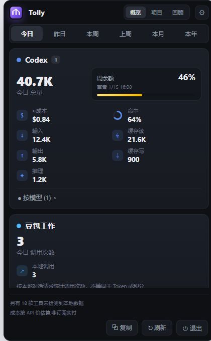
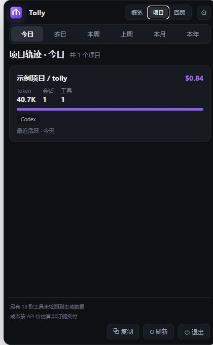

# Tolly for Windows

[](https://github.com/rui8001/tolly/actions/workflows/ci.yml)
[](LICENSE)
[](https://github.com/rui8001/tolly/releases/latest)

Tolly 是一个本地优先的 Windows 系统托盘应用，用来汇总 AI 编程工具写入本机的 Token、积分和可验证调用用量，并按公开 API 价格估算成本。数据默认留在本机，不需要把对话记录上传到统计服务。

[English README](README.en.md)

项目受到 macOS 开源项目 [Tokei](https://github.com/cclank/tokei) 的产品方向启发。部分本地日志采集规则和价格映射依据其 MIT 实现重构；Windows 外壳、界面资源和交互实现使用独立名称并重新设计。Tolly 不是 Tokei 的官方 Windows 版本，也不代表任何模型或工具服务商。



## 下载与安装

前往 [Releases](https://github.com/rui8001/tolly/releases/latest) 下载最新版本：

- `Tolly_1.2.0_x64-setup.exe`：推荐普通 Windows 用户使用，可直接覆盖旧版本升级。
- `Tolly_1.2.0_x64_en-US.msi`：适合需要 MSI 部署的环境。
- `SHA256SUMS.txt`：用于核对安装包完整性。

当前安装包尚未购买 Windows 代码签名证书，因此系统可能显示“未知发布者”。这不代表文件被篡改；请从本仓库 Release 下载，并用同一版本附带的 SHA-256 文件核验。

## 1.2.0 亮点

- 余额进度条按剩余比例使用四档渐变：工具主色、黄色、橙色和红色，风险状态更直观。
- 豆包工作可从本地 SDK 日志统计真实对话调用次数；不把调用次数伪装成 Token 或积分。
- 项目页读取日志中的真实工作目录，不再把 Codex 的日期目录误认为项目。
- 项目页支持今日、本周、本月等周期切换，并自动隐藏当前周期没有用量的项目。



## 当前能力

- 覆盖 20 个 AI 编程工具的 JSONL / SQLite 本地数据源；无法验证用量字段时只报告检测状态。
- 今日、昨日、本周、上周、本月、本年与全部用量。
- 按模型、项目、每日趋势与年度回顾聚合；项目视图跟随当前统计周期。
- Windows 托盘弹窗：单实例、失焦隐藏、托盘定位、手动/定时刷新。
- 优先显示服务商通过本地日志或本机只读接口提供的周余额或剩余积分；不允许手工填写或用 Token 消耗反推余额。
- Codex 显示与其设置页一致的账户“通用使用限额”，并忽略 Spark 等模型专属限额。
- WorkBuddy 显示日志记录的今日积分消耗；千问办公提供明确标注的本地 Token 估算和可选官方本机额度查询；豆包工作显示本地日志中可验证的对话调用次数。
- 发布包使用 PyInstaller sidecar，最终用户不需要安装 Python。

成本只是按价格表计算的估值，不是账单。余额仅来自服务商明确提供的额度字段，不通过 Token 用量反推。

## 目录

```text
tally-engine/   唯一的 Python 数据引擎与测试
tally-win/      Vite 前端与 Tauri 2 Windows 外壳
docs/           架构、隐私与发布检查清单
```

Windows 目录不再保存引擎副本。开发模式调用 `../tally-engine`，发布模式调用随安装包分发的 `tally-engine` sidecar，因此采集规则只有一份源码。

## 开发

前置条件：Python 3.10+、Node.js 20+、pnpm 11、Rust stable，以及带“使用 C++ 的桌面开发”组件的 Visual Studio Build Tools。

```powershell
# 引擎
cd tally-engine
python -m unittest discover -s tests -v
python -m engine --json

# Web 预览（只读匿名样例）
cd ../tally-win
pnpm install --frozen-lockfile
pnpm dev

# 或生成可直接双击打开的单文件预览
pnpm preview:build
# 打开 tally-win/preview-dist/index.html

# 桌面开发
$env:TALLY_PYTHON = "C:\path\to\python.exe" # Python 不在 PATH 时
pnpm tauri dev
```

在 Windows 上也可以直接双击仓库根目录的 `start-preview.cmd`。它只会调用项目本地安装的 Vite，并固定使用 `127.0.0.1:1420`；如果端口被旧进程占用会明确报错，不会悄悄显示旧页面。不要用通用静态服务器直接托管 `tally-win/src`，因为源码中的模块依赖需要由 Vite 解析。

依赖安装完成后，双击仓库根目录的 `start-desktop-dev.cmd` 可启动读取本机真实日志的 Tauri 开发版。脚本会先检查 MSVC、Node.js、Rust、Python 和前端依赖，缺项时给出明确提示。

发布构建还需要安装引擎构建依赖：

```powershell
python -m pip install -e "./tally-engine[build]"
cd tally-win
pnpm build
```

`pnpm build` 会先构建 Vite 前端和 PyInstaller sidecar，再由 Tauri 生成 NSIS/MSI 安装包。

成功后可在 `tally-win/src-tauri/target/release/bundle/nsis/` 和 `bundle/msi/` 找到安装包。安装包内置冻结后的数据引擎，最终用户不需要安装 Python。带 `v*` 的 Git 标签会触发 GitHub Actions 构建并上传版本化安装包，可用于手动覆盖升级；签名自动更新器将在仓库地址、签名公钥和回滚策略确定后再启用。

## 参与真实试用

Tolly 目前处于早期公开维护阶段，正在招募 Windows 10/11 x64 用户进行 15–20 分钟的自愿试用。试用不要求 Star、公开身份或上传真实日志；即使没有检测到任何支持的工具，也可以报告安装和界面体验。

- 按[真实用户试用说明](docs/USER_TESTING.md)操作。
- 通过[隐私安全的试用反馈表](https://github.com/rui8001/tolly/issues/new?template=usability_report.yml)提交结果。
- 查看[从零开始的公开结果台账](docs/USER_TEST_RESULTS.md)。

不要在 Issue 中上传原始日志、提示词、用户名、项目路径、账户标识或 API Key。维护者自测、自动检查和下载次数不会被冒充为真实用户反馈。

## 隐私

默认采集、聚合和设置保存均在本机完成。只有显式运行 `python -m engine update-prices`、主动开启 Grok 实时配额，或在设置中开启千问办公剩余积分查询时，相关客户端才可能发起网络请求。详情见 [隐私说明](docs/PRIVACY.md)。

仓库中的 `sample_usage.json` 是人工编写的匿名数据。`scripts/check-privacy.mjs` 和 CI 会阻止常见个人主目录路径混入数据文件。

## 开源与归属

本项目代码采用 [MIT License](LICENSE)。第三方组件、上游参考关系和归属说明见 [THIRD_PARTY_NOTICES.md](THIRD_PARTY_NOTICES.md)。维护者发布版本前应完成 [发布检查清单](docs/RELEASE_CHECKLIST.md)。

上游参考范围、固定提交、文件哈希和独立实现边界记录在[来源与许可台账](docs/UPSTREAM_PROVENANCE.md)中。

版本变化记录见 [CHANGELOG.md](CHANGELOG.md)，维护者发布流程见 [docs/RELEASING.md](docs/RELEASING.md)。欢迎通过 [CONTRIBUTING.md](CONTRIBUTING.md) 参与，安全与隐私问题请按 [SECURITY.md](SECURITY.md) 私下报告。
